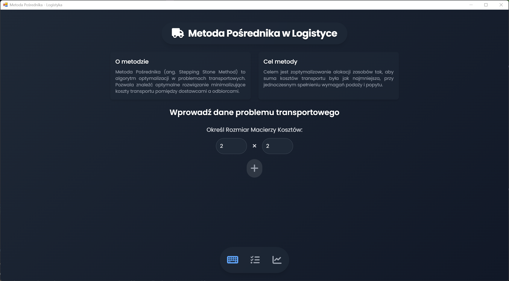
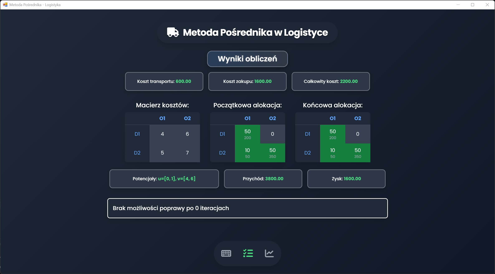
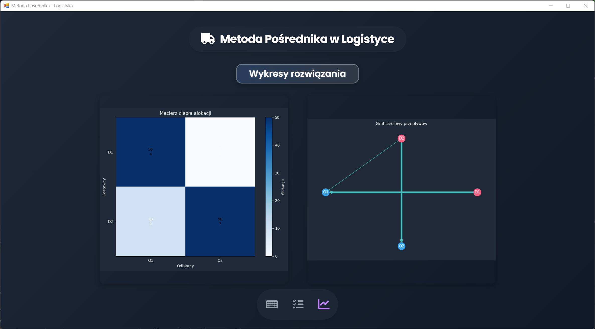

# 🇵🇱 Metoda Pośrednika - Logistyka

## Opis projektu

Aplikacja demonstruje wykorzystanie Metody Pośrednika w problemach transportowych. Pozwala wprowadzić dane dotyczące kosztów transportu, podaży i popytu, a następnie oblicza optymalne rozwiązanie minimalizujące koszty. Dodatkowo generuje przydatne wizualizacje: macierz ciepła (heatmap) oraz graf sieciowy przepływów.

## Wymagania

- Python 3.x

- PyWebView

- Matplotlib

- NetworkX

## Instalacja

1. Sklonuj repozytorium:

    ```bash
    git clone https://github.com/TwojeRepozytorium/Metoda-Posrednika.git
    cd Metoda-Posrednika
    ```

2. Zainstaluj wymagane biblioteki:

    ```bash
    pip install pywebview matplotlib networkx
    ```

3. Uruchom aplikację:

    ```bash
    python Main.py
    ```

## Funkcje

- Tworzenie macierzy kosztów transportu

- Obliczanie optymalnej alokacji zasobów metodą Pośrednika

- Generowanie wykresów (heatmap, graf sieciowy)

- Podsumowanie wyników, w tym całkowitego kosztu rozwiązania

---

# 🇺🇸 Intermediary Method - Logistics

## Project Description

This application demonstrates the use of the Intermediary Method in transportation problems. It allows entering cost, supply, and demand data, then calculates an optimal transport allocation minimizing total costs. It also generates helpful visualizations: a heatmap matrix and a flow network graph.

## Requirements

- Python 3.x

- PyWebView

- Matplotlib

- NetworkX

## Installation

1. Clone the repository:

    ```bash
    git clone https://github.com/YourRepository/IntermediaryMethod.git
    cd IntermediaryMethod
    ```

2. Install the required libraries:

    ```bash
    pip install pywebview matplotlib networkx
    ```

3. Run the application:

    ```bash
    python Main.py
    ```

## Features

- Creating a transport cost matrix

- Calculating optimal resource allocation via the Intermediary Method

- Generating plots (heatmap, flow network)

- Summarizing results, including total cost

## Screenshots






